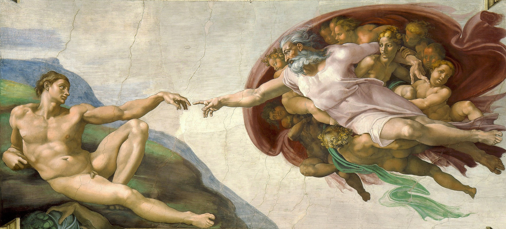

<h1>Hey, I'm Rimon Dipta</h1>

  <b>Full-Stack Developer | Creative Technologist | Problem Solver</b>

  I build pixel-perfect, engaging, and performance-driven applications. 
  Specializing in the <b>MERN Stack</b> and <b>Desktop Automation</b>.

  <i>
    "Coding with the precision of Michelangelo, the magic of Hogwarts, and the spirit of a Shonen hero."
  </i>
   
  When I'm not debugging, I'm likely lost in an <b>Anime</b> arc, re-visiting the wizarding world of <b>Harry Potter</b>,  
  or studying the timeless art of <b>Michelangelo</b>.

 

---

## 🛠 The Arsenal

I focus on tools that allow for rapid development without compromising on performance or design.

|               **Frontend**               |        **Backend**        |    **Tools & Design**     |
| :--------------------------------------: | :-----------------------: | :-----------------------: |
| React, Tailwind CSS, SCSS, Framer Motion | Node.js, Express, MongoDB | Docker, Git/GitHub, Figma |

 

  

---

## 📬 Let's Connect

Open to new opportunities, collaborations, or just a chat about tech (or anime theories).

&nbsp;

